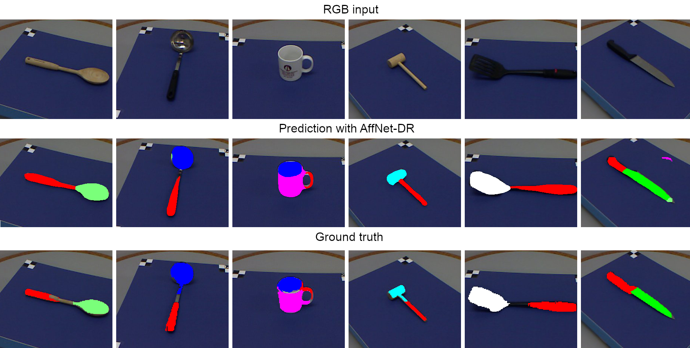

# AffNet-DR

**PDF VERSION OF PAPER HAS BEEN UPLOADED TO THIS REPOSITORY NAMED:** 0544.pdf

This repository contains the implementation of our AffNet-DR network trained on synthetic data for our paper "Learning to Segment Object Affordances on Synthetic Data for Task-oriented Robotic Handovers". AffNet-DR was trained solely on our synthetic object affordance dataset generated in the Unity game engine with the domain randomization method. AffNet-DR performs object detection and affordance segmentation in parallel. The architecture is a modified version of AffordanceNet. 

A synthetic dataset already generated can be downloaded from here https://drive.google.com/file/d/1yRL2JbZhZEsL2O9fKbM_DDJ7U53dogkl/view?usp=sharing




https://user-images.githubusercontent.com/34643562/194014531-273096b6-8c9e-4ef6-977b-2a4cd071b95d.mp4

<!--https://user-images.githubusercontent.com/34643562/156930601-6c346708-aa64-4634-a4c1-de12992b0bf6.mp4 -->


## Links to affiliated repositories

The dataset generator implemented in the Unity game engine can be found here: https://github.com/HuchieWuchie/affordanceSynthetic  
The ROS node implementation for the UR5 robot can be found here: https://github.com/HuchieWuchie/affnetDRROS

## Requirements

```
CUDA 11.1
CudNN 8
Pytorch v. 1.10.0
torchvision v. 0.11.1

sudo apt-get install libglib2.0-0 libxrender-dev libsm6 libxext6 -y
pip3 install scipy opencv-python==4.2.0.32 
```

## Training
AffNet-DR supports training on both the UMD dataset and the synthetic dataset called AFF-Synth.

Links:

UMD: http://users.umiacs.umd.edu/~fer/affordance/part-affordance-dataset/  
AFF-Synth: https://drive.google.com/file/d/1yRL2JbZhZEsL2O9fKbM_DDJ7U53dogkl/view?usp=sharing  


Train AffNet-DR by running train.py with with the following parameters specified.
```
python3 train.py -h

  --gpu                 GPU device id to use if not declared will use CPU
  --epochs NUM_EPOCHS   Number of epochs to train, default=15
  --batch_size BATCH_SIZE
                        Number of images in a batch to train, default=1
  --dataset_path DATASET_PATH
                        Path to root dataset directory
  --output_path OUTPUT_PATH
                        Path to output logs, weights and checkpoints
  --dataset DATASET_NAME
                        Dataset name to train on [IIT-AFF, UMD, AFF-Synth]
  --skip_evaluation     Skip evaluation after each epoch, and only evaluate at
                        the end.
  --restart             Will continue from checkpoint in specified output_path
                        if not specified.
```

## Evaluation

After training the network, the network can be evaluated with the weighted F measure score on the UMD dataset. We also provide pretrained weights  

Trained on AFF-Synth: https://drive.google.com/file/d/1psCn_aT5KUyQDJrdxqR7GJgHeCewGokS/view?usp=sharing  
Trained on UMD: https://drive.google.com/file/d/1q_IqXJ04mD4qUl3jxdEkMukMACFLbJIh/view?usp=sharing  

```
python3 eval.py

  -h, --help            show this help message and exit
  --gpu                 GPU device id to use if not declared will use CPU
  --dataset_path DATASET_PATH
                        Path to root dataset directory
  --weights_path WEIGHTS_PATH
                        Path to .pth pretrained weights file
  --dataset_target DATASET_TARGET
                        Dataset name to evaluate on [IIT-AFF, UMD, AFF-Synth]
  --dataset_source DATASET_SOURCE
                        Dataset name which the network was trained on [IIT-
                        AFF, UMD, AFF-Synth]
```

Expected results with pretrained weights:

Grasp: 0.611  
Cut: 0.604  
Scoop: 0.639  
Contain: 0.71  
Pound: 0.804  
Support: 0.578  
W-Grasp: 0.785  
Average: 0.676  

## Demo
We provide a demo script for demonstrating the behavior of the network. Run the demo script.
```
python3 demo.py

  -h, --help            show this help message and exit
  --gpu                 GPU device id to use if not declared will use CPU
  --input INPUT_PATH    Path to rgb image
  --output OUTPUT_PATH  Prediction output folder
  --weights WEIGHTS_PATH
                        Pre-trained weights file
  --dataset DATASET_NAME
                        Dataset which the network was trained on [IIT-AFF,
                        UMD, AFF-Synth]
  --object_threshold OBJECT_CONFIDENCE_THRESH
                        Confidence threshold score for object detection,
                        between 0 and 1, default = 0.9
  --affordance_threshold AFFORDANCE_CONFIDENCE_THRESH
                        Confidence threshold score for affordance
                        segmentation, between 0 and 1, default = 0.4
```


## Authors

Albert Daugbjerg Christensen  
Daniel Lehotský  
Marius Willemoes Jørgensen  
Dimitrios Chrysostomou
